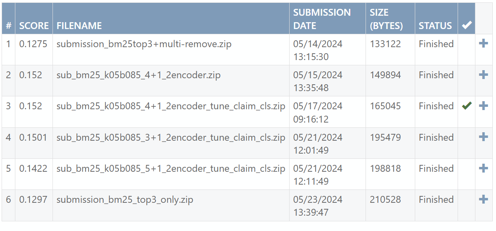
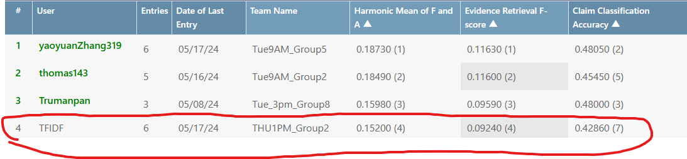

# COMP90042-Top-4-Solution-Project-Fact-Verification-System

# Project-Description
This project focuses on classifying claims into four categories: SUPPORTS, REFUTES, NOT_ENOUGH_INFO, and DISPUTED. The classification is based on evidence retrieved from a corpus containing over a million pieces of evidence. Developed by the Natural Language Processing team at the University of Melbourne, this project employs a two-stage retrieval and classification approach.

Initially, we use the BM25 algorithm for evidence retrieval. To enhance the retrieval process, we implemented a custom encoder model to identify additional relevant evidence not captured by BM25. Subsequently, another encoder model is utilized to predict the claim label based on the retrieved evidence.

# Ranking of the Project on Codalab
According to the result from the final evaluation, our approachs could achieve 0.152 overall Harmonic Mean of F and A to classify claim:

also ranked 4th in the leaderboard:

finally, Received 3 bonus mark in Project 1 since rank in top 10

# Result of the Project

## Report Feedback Summary

Below are the feedback of report from teaching teams:

| Component  | Criteria         | Total Marks | Gained Marks | Comments                                                                                                                                 |
|------------|------------------|-------------|--------------|------------------------------------------------------------------------------------------------------------------------------------------------------|
| Writing    | Clarity          | 5           | 4            | Understandable by most readers.                                                                                                                       |
| Writing    | Tables/Figures   | 4           | 3            | (i) Several tables and figures have vague and uninformative titles (i.e., Figure 2, Table 1, Table 4, Table 5). Table 1 has a different format.             |
| Content    | Soundness        | 7          | 5            | Unclear how EDA provides insight, some values are randomly picked or not clearly explained, architecture design not clearly justified.                  |
| Content    | Substance        | 5           | 4            | Students did more than expected but did not report scores for bi-encoder and cross encoder using RNN and LSTM.                                         |
| Content    | Novelty          | 5           | 3            | Mostly replicating existing ideas.                                                                                                                    |
| Content    | Results          | 5           | 5            | Results are very convincing and clearly articulated.                                                                                                  |
| Scholarship| Citation         | 4           | 3            | The cited sources are mostly credible and appropriate for the topic. Missing citations for Transformers, cross encoder, and bi-encoder.                                                                                     |
| **Total**  |                  | **35**      | **27**       |                                                                                                                                                      |


The final marks: 27(Report) + 3(Codalab Bonus Mark) = 30

# How to Reproduce the Submission File on Codalab

### Step-by-Step Instructions

#### Step 1: Data Preparation

- **Notebook:** `step1_eda_and_data_prep.ipynb`
- **Input Files:**
  - `dev-claims.json`
  - `train-claims.json`
  - `test-claims-unlabelled.json`
  - `evidence.json`
- **Description:** This notebook processes the JSON files provided and outputs CSV files for development, testing, and training datasets.
- **Output Files:**
  - `dev.csv`
  - `test.csv`
  - `train.csv`
  - `evidence.csv`

#### Step 2: Initial Ranking with BM25

- **Notebook:** `step2_initial_ranking.ipynb`
- **Input Files:**
  - `dev.csv`
  - `test.csv`
  - `train.csv`
  - `evidence.csv`
- **Description:** Preprocessing the claim and all evidences by remove punctuation and convert to lowercase, then lemmatize text and remove stopwords. Performing an initial ranking of evidences using the BM25 algorithm and outputs the top 20 evidences. In this stage, we found k1 = 0.5, and b = 0.85 could compromise the result between train and dev about their recall and precision.
- **Output Files:**
  - `train_k05b085_bm25_top20.csv`
  - `dev_k05b085_bm25_top20.csv`
  - `test_k05b085_bm25_top20.csv`

#### Step 3: Adding Evidence with Transformer Model

- **Notebook:** `step3_add_evidence.ipynb`
- **Input Files:** All CSV files from previous steps
- **Description:** The final retrieval result is based on the top 4 pieces of evidence found by BM25, combined with the top evidence ranked by a transformer model. The transformer uses a cross-encoder approach, where the claim and each of its top associated BM25 evidences are concatenated and evaluated to determine the probability of being a true claim-evidence pair. Due to restrictions on pretrained transformers imposed by the teaching team, the transformer model in this session is self-implemented. It includes word embeddings, positional embeddings, and two custom transformer blocks. 
- **Output Files:**
  - `train_retrival_result_with_transformer.csv`
  - `dev_retrival_result_with_transformer.csv`
  - `test_retrival_result_with_transformer.csv`

#### Step 4: Claim Label Classification

- **Notebook:** `step4_claim_label_cls.ipynb`
- **Input Files:** Output from Step 3
- **Description:** An encoder model is used to predict the claim label based on the concatenation of the claim text and all evidence found in Step 3. This model replicates the architecture from the previous step. However, achieving high claim classification accuracy is challenging if the retrieval F-Score in the evidence retrieval stages is unsatisfactory. Thus, improving our evidence retrieval process remains an area for further enhancement.
- **Output File:**
  - `test-output.json`

### Other Files

- **Notebook:** `exploring_initial_ranking_tfidf.ipynb`
- **Description:** This notebook mainly explores the results of TF-IDF in the initial ranking, but it was not progressed to the next stages due to low performance.

## Required Packages

To run the notebooks in this project, ensure you have the following packages installed:

- **Pandas:** For data manipulation and analysis.
- **NumPy:** For numerical operations.
- **TensorFlow:** For building and training neural network models.
- **Scikit-Learn:** For machine learning tools.
- **SpaCy:** For natural language processing.
- **NLTK:** For text processing and tokenization.
- **Rank-BM25:** For implementing the BM25 algorithm for ranking.
- **os, time, string, collections.Counter, ast:** For various utility functions and data structure manipulation.

### Additional Steps
Some libraries may require additional setup after installation:
SpaCy: Download the English model with:
```
python -m spacy download en_core_web_sm
```
NLTK: Download necessary data and tokenizers with:
```
import nltk
nltk.download('punkt')
```
### Running Device
- Tested Environment: Google Colab (Free Version)
- Resources: GPU: Nvidia T4 (Free version of Colab), RAM: Up to 5GB, GPU RAM: Up to 4.5GB

# Acknowledgments
This program was created as a project for COMP90042 Natural Language Processing at University of Melbourne. Special thanks to teaching teams for their guidance and support.

